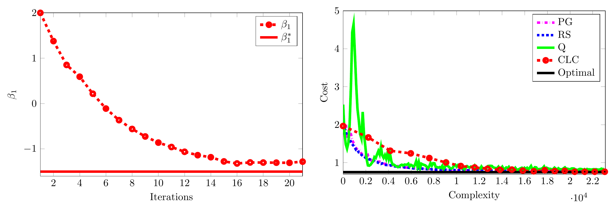
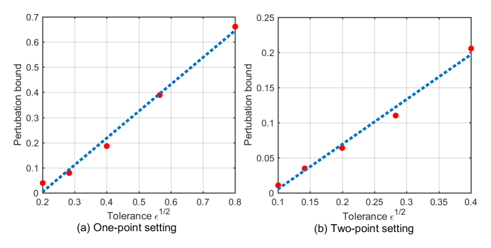

# About Me

I am a PhD candidate in Systems Engineering at the [IDS Lab](https://ids-lab.net/) at Cornell University, working at the intersection of optimal control, machine learning, and robotics. 

My work combines theoretical analysis with practical implementation. I develop optimization and learning algorithms, build simulation and ROS 2 pipelines, and validate control methods on the [LIMO ROS2 robots](https://global.agilex.ai/products/limo-ros2).

Previously, I conducted research at the [Institute of Automotive Technology](https://www.mos.ed.tum.de/ftm/startseite/) at the Technical University of Munich, where I contributed to vehicle-dynamics modeling for [TUM Autonomous Motorsport](https://www.mos.ed.tum.de/en/ftm/main-research/intelligent-vehicle-systems/tum-autonomous-motorsport/). I received my Diploma in Mechanical Engineering from the National Technical University of Athens, graduating with a GPA of 8.82/10 and ranking in the top 3.57% of my class.

---

<!-- --- -->

<!-- # News

1. **Feb 2026** – Paper accepted at IEEE CDC 2026.
2. **Jan 2026** – Released new GitHub repository on Hamiltonian residual learning.
3. **Dec 2025** – Presented work at [Conference Name].
4. **Aug 2025** – Started PhD at Cornell University.

--- -->
# Projects
## Real-Time Optimal Multi-Robot Navigation

## Real-Time Optimal Multi-Robot Navigation

Working with Dr. Viet-Anh Le, we developed a machine-learning-enhanced MPC framework for real-time multi-robot navigation with joint optimization of the robots’ trajectories. The framework combines graph neural networks with distributed optimization to accelerate the solution of the underlying multi-robot mixed-integer quadratic program (MIQP).

**My Contributions:** I integrated Dr. Viet-Anh Le’s learning-based optimization algorithm into an MPC framework and connected it to a complete ROS 2 navigation pipeline without modifying the optimizer itself. I implemented a trajectory-tracking controller based on input-output linearization of the unicycle model, configured an Extended Kalman Filter for state estimation, and trained the optimizer’s graph neural network using simulation data in Python and PyTorch. I then integrated the complete system in ROS 2, developed a Gazebo simulation environment from scratch, tuned and debugged the navigation stack, and validated it on three physical LIMO robots.

**Results:** The navigation stack solves the multi-robot MIQP in under 200 ms while coordinating three physical robots at speeds of up to 0.5 m/s.

- 📄 [Paper](https://ieeexplore.ieee.org/abstract/document/11312656)
- 💻 [GitHub Repository](https://github.com/Panos20102k/Multi-Limo-Control)
- 🎥 [Project Video](https://www.youtube.com/watch?v=3Of0j3a5fGw)

<iframe
  src="https://www.youtube.com/embed/3Of0j3a5fGw"
  title="Real-Time Optimal Multi-Robot Navigation on LIMO Robots"
  style="display: block; width: 100%; aspect-ratio: 16 / 9; border: 0; margin: 1rem 0;"
  allow="accelerometer; autoplay; clipboard-write; encrypted-media; gyroscope; picture-in-picture; web-share"
  allowfullscreen>
</iframe>

---

## Vehicle Dynamics Modeling for Autonomous Racing

Working with Dr. Simon Sagmeister, we developed [Open-Car-Dynamics](https://github.com/TUMFTM/Open-Car-Dynamics), a high-fidelity multi-body vehicle dynamics model for the autonomous formula race car of TUM Autonomous Motorsport. We validated the model through software-in-the-loop testing against data recorded from the fastest lap of TUM Autonomous Motorsport in Monza 2023, with vehicle speeds up to 267 km/h. 

**My Contributions:** I developed an [initial version](https://dspace.lib.ntua.gr/xmlui/handle/123456789/58426) of the vehicle dynamics model, and later contributed to its implementation in C++ and integration into the software stack of the team.

**Results:** We evaluated the simulation accuracy of our model and of several simplified versions of it that are commonly used in practice. The results of the comparison address the question: *What is important to model in vehicle dynamics for autonomous racing?*

- 📄 [Paper](https://ieeexplore.ieee.org/abstract/document/10588858)
- 💻 [GitHub Repository](https://github.com/TUMFTM/Open-Car-Dynamics)
- 🎥 [Project Video](https://www.youtube.com/watch?v=2uVidmMZ9ns)

  <iframe
    src="https://www.youtube.com/embed/2uVidmMZ9ns"
    title="Open-Car-Dynamics: Vehicle Dynamics Modeling for Autonomous Racing"
    style="position: absolute; top: 0; left: 0; width: 100%; height: 100%; border: 0;"
    allow="accelerometer; autoplay; clipboard-write; encrypted-media; gyroscope; picture-in-picture; web-share"
    allowfullscreen>
  </iframe>

  

---

## Combined Learning and Control

I developed the [CLC](https://github.com/Panos20102k/Learning-LQR) algorithm, a new algorithm for optimal control problems with unknown system dynamics based on dynamic programming and stochastic gradient descent. Instead of identifying a complete dynamics model before computing a controller, CLC iteratively learns cost parameters to converge to the optimal policy.
I then implemented benchmark reinforcement learning algorithms: Policy Gradient, Random Search and Q-learning, and compared them with CLC in the linear quadratic regulator problem.

**Results:** CLC successfully learns the parameters required to recover the optimal control cost without knowledge of the real system dynamics. Although less sample-efficient than methods tailored to linear policies, it required fewer structural assumptions and can accommodate nonlinear optimal feedback laws.

- 📄 [Paper](https://ieeexplore.ieee.org/abstract/document/11615492)
- 💻 [GitHub Repository](https://github.com/Panos20102k/Learning-LQR)

  

---

## Safety-Constrained Optimal Control for Unknown Dynamics

I developed a theoretical framework for solving continuous-time optimal control problems when the plant dynamics are unknown and safety constraints must be satisfied. Using convex analysis and Pontryagin’s Minimum Principle, I established conditions under which model-derived control decisions remain optimal for the physical system.

I implemented the framework for adaptive cruise control and validated it experimentally on the LIMO ROS 2 robots, including scenarios with active rear-end safety constraints.

**Results** Experiments on two LIMO robots showed that the penalized model-based controller recovered the same optimal control strategy as a controller with access to the true plant dynamics, despite substantial errors in the assumed actuation gain and time constant. The ego robot regulated its velocity while respecting the rear-end safety constraint, demonstrating that accurate system identification is not always necessary for safe and optimal control.

- 📄 [Paper](https://arxiv.org/abs/2603.27677)
- 💻 [GitHub Repository](https://github.com/Panos20102k/Multi-Limo-Control) 
- 🎥 [Project Video](https://www.youtube.com/watch?v=pMSZKlU5O44)

  <iframe
    src="https://www.youtube.com/embed/pMSZKlU5O44"
    title="Safety-Constrained Optimal Control on LIMO Robots"
    style="position: absolute; top: 0; left: 0; width: 100%; height: 100%; border: 0;"
    allow="accelerometer; autoplay; clipboard-write; encrypted-media; gyroscope; picture-in-picture; web-share"
    allowfullscreen>
  </iframe>

---

## Robust Derivative-Free LQR

I implemented and evaluated a derivative-free stochastic optimization method for learning linear-quadratic regulators without direct model or gradient information. The study characterizes how errors in gradient estimation affect convergence and closed-loop performance.

**Results** Numerical experiments demonstrated that both one-point and two-point derivative-free methods converge toward the optimal LQR policy despite errors from noisy measurements and approximate cost evaluations. The experiments also confirmed the theoretical relationship between the allowable perturbation and the desired accuracy, providing practical guidance for selecting the sampling radius, step size, and rollout length.

- 📄 [Paper](https://ieeexplore.ieee.org/abstract/document/11610893)

  

---

# Fellowships & Awards

- Cornell Systems Engineering Fellowship (2024-2025)
- IEEE CDC 2025 Student Travel Award
- ACC 2026 Student Travel Award

---

# Teaching

- Lead Teaching Assistant – CEE 3040 Uncertainty Analysis in Engineering (Cornell, Fall 2025)
- Teaching Assistant – CEE 6080 Optimal Control & Decision Theory (Cornell, Spring 2026)
